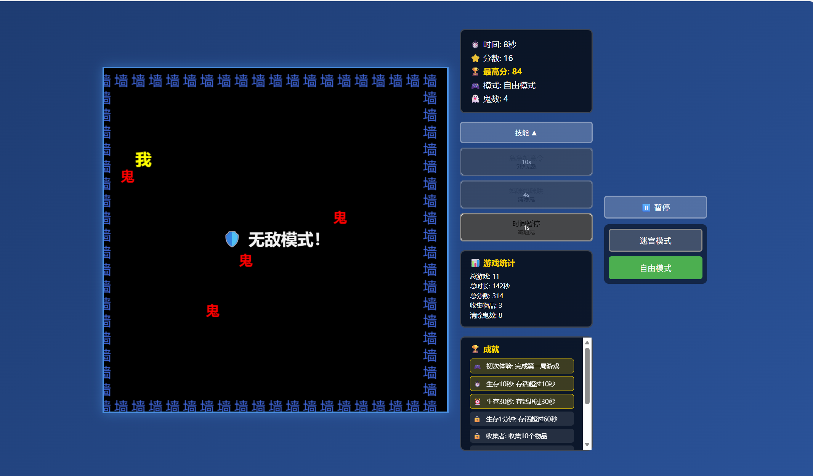
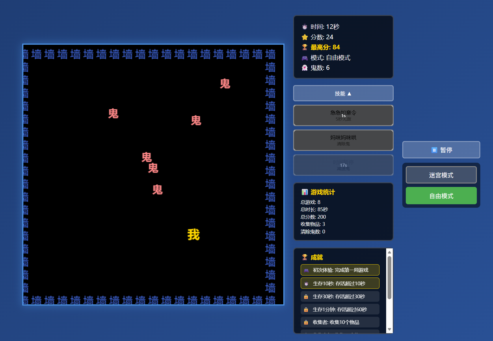
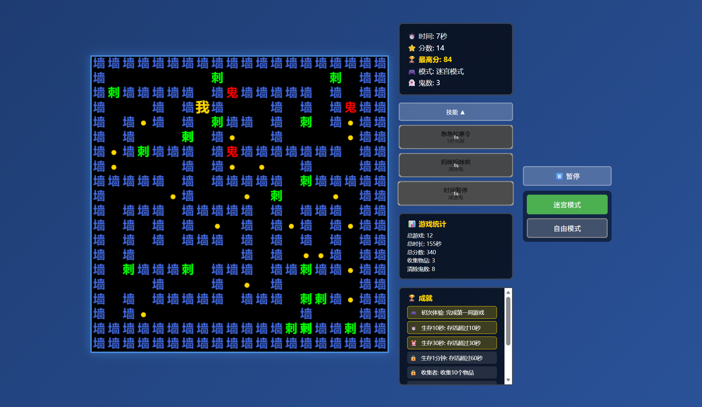
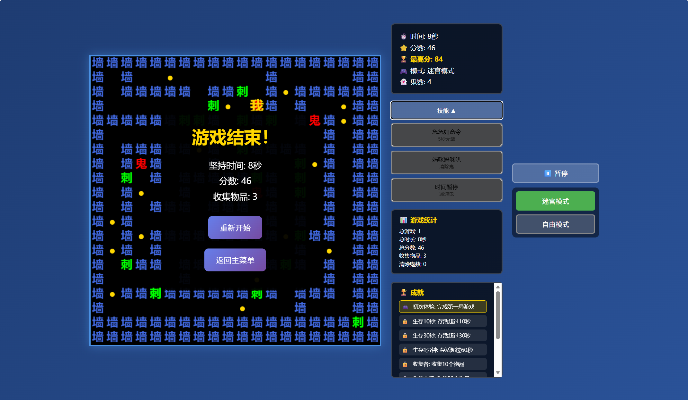

# 🎮 汉字鬼抓人小游戏

一个基于HTML5 Canvas开发的汉字主题追逐游戏，玩家需要控制"我"字角色躲避"鬼"字的追捕，在迷宫中收集物品，尽可能长时间生存。

---

## 📢 项目由来

在抖音疯狂被鬼抓人游戏刷屏，所以我用 **KAT-Coder-Pro V1** 模型开发了出来！

> 💡 **使用 KAT-Coder-Pro V1 模型，将你的绝佳创意变为现实！**
> 
> 无论是**效率工程**、**游戏开发**还是**智能应用**，KAT-Coder-Pro V1 都能帮你快速实现想法。从零到一，从概念到成品，让AI成为你最得力的编程伙伴！

如果你也想体验这个超火的汉字鬼抓人游戏，

如果你想在电脑上随时玩，不用下载APP，

如果你想挑战自己的反应速度和策略能力，

试试这个宝藏游戏，直接打开就能玩，不用到处找资源，不用注册登录！

👉 **不用注册！不用登录！** 打开即玩，零门槛、超便捷！

👉 **纯前端实现**，单文件运行，体验无比丝滑～

👉 **双模式切换**，迷宫模式考验策略，自由模式考验反应！

👉 **完整功能**，成就系统、粒子特效、技能系统一应俱全，比原版更丰富！

👉 **数据永久保存**，最高分、成就、统计全记录，刷新也不丢失！

---

## ✨ 项目亮点

### 🎯 双模式游戏体验
- **迷宫模式**：使用递归回溯算法生成完美迷宫，确保所有区域可达，无死路
- **自由模式**：经典自由移动模式，更快的节奏和更刺激的体验
- 支持游戏内实时切换模式

### 🎨 独特的汉字主题设计
- 所有游戏元素均使用汉字表示：
  - 🟡 **我** - 玩家角色（黄色）
  - 🔴 **鬼** - 敌人（红色）
  - 🔵 **墙** - 迷宫墙壁（蓝色）
  - 🟢 **刺** - 危险障碍（绿色）
- 像素风格的汉字渲染，复古而有趣

### 🛡️ 丰富的技能系统
- **急急如意令**：5秒无敌模式，免疫所有伤害
- **妈咪妈咪哄**：清除所有鬼，获得喘息机会
- **时间暂停**：减速所有鬼5秒，创造逃脱机会
- 每个技能都有冷却时间，需要策略性使用

### 🏆 完整的成就系统
- 9个不同类型的成就等待解锁：
  - 🎮 初次体验
  - ⏱️ 生存挑战（10秒/30秒/60秒）
  - ⭐ 收集者/收集大师
  - 👻 鬼杀手
  - 🌟 高分王
  - ✨ 完美游戏
- 成就解锁时会有炫酷的动画通知

### 📊 详细的游戏统计
- 记录总游戏数、总游戏时长、总分数
- 统计收集物品总数和清除鬼数
- 所有数据保存在本地存储，永久保存

### 🎆 炫酷的视觉效果
- **粒子效果系统**：
  - 收集物品时产生金色粒子爆炸
  - 清除鬼时产生红色粒子特效
  - 粒子具有重力效果和渐隐动画
- **道具效果提示**：使用技能时屏幕中央显示动画提示
- **成就通知**：解锁成就时的弹窗动画

### 🎮 完善的游戏机制
- **难度系统**：简单/普通/困难三种难度可选
- **完美迷宫生成**：使用递归回溯算法，确保迷宫连通性
- **智能AI**：鬼会寻路追踪玩家，增加游戏挑战性
- **碰撞检测**：精确的碰撞检测系统
- **暂停功能**：随时暂停游戏

### 💾 数据持久化
- 使用LocalStorage保存游戏数据
- 最高分记录
- 成就解锁状态
- 游戏统计数据
- 刷新页面后数据不丢失

### 🎨 精美的UI设计
- 现代化的渐变背景
- 半透明面板设计
- 响应式布局，适配不同屏幕
- 按钮在画布左右两侧，不遮挡游戏画面
- 可折叠的技能面板

### 🎯 游戏特色
- **收集系统**：迷宫模式中收集黄色圆点获得分数
- **危险元素**：避开红色"鬼"和绿色"刺"
- **边界循环**：自由模式中边界可以循环穿越
- **实时反馈**：游戏信息实时更新显示

## 📸 Demo 演示

### 游戏截图

<div align="center">

#### 主菜单界面


#### 迷宫模式游戏画面


#### 自由模式游戏画面


#### 游戏统计和成就面板


</div>

---

## 🚀 快速开始

1. 直接在浏览器中打开 `抖音汉字鬼抓人小游戏.html` 文件
2. 选择难度（简单/普通/困难）
3. 点击"开始游戏"
4. 使用方向键或WASD控制角色移动
5. 尽可能长时间生存，收集物品，解锁成就！

## 🎮 操作说明

| 操作 | 说明 |
|------|------|
| **移动** | 方向键 ↑↓←→ 或 WASD |
| **技能** | 点击左侧技能按钮 |
| **暂停** | 按 ESC 或空格键 |
| **模式切换** | 点击右侧模式选择按钮 |

## 📱 技术栈

| 技术 | 用途 |
|------|------|
| **HTML5 Canvas** | 游戏渲染 |
| **JavaScript ES6+** | 游戏逻辑 |
| **CSS3** | 样式和动画 |
| **LocalStorage** | 数据持久化 |

## 🎨 核心算法

| 算法 | 用途 |
|------|------|
| **递归回溯算法** | 生成完美迷宫，确保所有区域可达 |
| **A*寻路算法** | 鬼的智能追踪系统 |
| **粒子系统** | 物理效果和动画渲染 |

## 📈 游戏数据

游戏会自动记录以下数据：

- ✅ **最高分** - 历史最高分数
- ✅ **总游戏数** - 累计游戏次数
- ✅ **总游戏时长** - 累计游戏时间（秒）
- ✅ **总收集物品数** - 累计收集的物品数量
- ✅ **总清除鬼数** - 累计清除的鬼数量
- ✅ **成就解锁状态** - 所有成就的解锁情况

## 🎯 游戏目标

- 🎯 **生存挑战** - 尽可能长时间生存
- ⭐ **高分挑战** - 收集更多物品获得高分
- 🏆 **成就收集** - 解锁所有成就
- 💪 **难度挑战** - 挑战更高难度

## 🌟 项目特色

- 🚀 **纯前端实现** - 无需服务器，单文件即可运行
- 📦 **零依赖** - 不依赖任何外部库或框架
- 📱 **响应式设计** - 适配不同屏幕尺寸
- ✨ **完整功能** - 从游戏逻辑到UI设计一应俱全
- 📝 **代码规范** - 清晰的代码结构和注释

## 📝 更新日志

### v1.0.0
- ✅ 双模式游戏（迷宫/自由）
- ✅ 完整的成就系统
- ✅ 游戏统计功能
- ✅ 粒子效果系统
- ✅ 技能系统
- ✅ 难度选择
- ✅ 数据持久化

---

## 💬 开发 Prompt

本项目使用 **KAT-Coder-Pro V1** 模型开发，以下是核心开发提示词：

### 初始需求 Prompt

```
我想做图中这种汉字鬼抓人的游戏

游戏需求：
1. 玩家用"我"字表示（黄色）
2. 鬼用"鬼"字表示（红色）
3. 墙壁用"墙"字表示（蓝色）
4. 刺用"刺"字表示（绿色）
5. 有收集物品（黄色圆点）
6. 游戏在网格上运行
7. 需要两种模式：迷宫模式和自由模式
8. 迷宫模式使用网格移动，自由模式使用连续移动
9. 添加技能系统：无敌、清除鬼、减速鬼
10. 添加成就系统和游戏统计
11. 添加粒子效果和视觉效果
12. 按钮放在画布左右两侧，不遮挡游戏
13. 使用递归回溯算法生成完美迷宫，确保无死路
14. 刺应该替换部分墙，而不是放在通道上
```

### 功能扩展 Prompt

```
继续丰富功能：
1. 添加成就系统（9个成就）
2. 添加游戏统计（总游戏数、总时长、总分数等）
3. 添加粒子效果（收集物品、清除鬼时）
4. 添加道具效果提示动画
5. 添加成就通知动画
6. 数据持久化保存
7. 优化UI布局，按钮在左右两侧
8. 添加主菜单和游戏说明
```

### 优化 Prompt

```
优化游戏体验：
1. 修复迷宫死路问题，使用递归回溯算法
2. 修复刺的位置，让刺替换墙而不是挡住路
3. 优化按钮布局，避免遮挡游戏画面
4. 添加暂停功能
5. 添加难度选择
6. 完善成就检查逻辑
```

---

## 📚 项目说明文档

### 项目结构

```
抖音汉字鬼抓人小游戏/
├── 抖音汉字鬼抓人小游戏.html  # 主游戏文件（单文件包含所有代码）
├── README.md                   # 项目说明文档
├── background.jpg              # 背景图片（可选）
└── 截图/                       # 游戏截图
    ├── 1.png                  # 主菜单界面
    ├── 2.png                  # 迷宫模式
    ├── 3.png                  # 自由模式
    └── 4.png                  # 统计成就面板
```

### 核心文件说明

- **抖音汉字鬼抓人小游戏.html**：完整的单文件游戏，包含：
  - HTML结构
  - CSS样式（游戏UI、动画效果）
  - JavaScript游戏逻辑（约1400行代码）
  - 所有功能集成在一个文件中

### 技术实现细节

#### 1. 迷宫生成算法
- 使用递归回溯算法（Recursive Backtracking）
- 确保迷宫连通性，无死路
- 随机生成，每次游戏都不同

#### 2. 游戏循环
- 使用 `requestAnimationFrame` 实现60FPS流畅运行
- 分离渲染逻辑和游戏逻辑
- 优化性能，避免不必要的计算

#### 3. 数据存储
- 使用 `localStorage` API
- 存储键值：
  - `highScore`: 最高分
  - `totalGames`: 总游戏数
  - `totalTime`: 总时长
  - `totalScore`: 总分数
  - `totalCollectibles`: 总收集数
  - `totalGhostsKilled`: 总清除鬼数
  - `achievements`: 成就解锁状态（JSON）

#### 4. 粒子系统
- 自定义粒子类
- 物理效果（重力、速度衰减）
- 渐隐动画
- 性能优化（自动清理过期粒子）

#### 5. 碰撞检测
- 网格模式：坐标精确匹配
- 自由模式：矩形碰撞检测
- 实时检测，即时反馈

### 浏览器兼容性

- ✅ Chrome/Edge (推荐)
- ✅ Firefox
- ✅ Safari
- ✅ 移动端浏览器（部分功能可能受限）

### 性能优化

1. **粒子系统**：限制最大粒子数量，自动清理
2. **渲染优化**：只重绘变化区域
3. **事件节流**：成就检查每5秒一次
4. **内存管理**：及时清理过期对象

### 扩展建议

如果想进一步扩展功能，可以考虑：

1. **音效系统**：添加背景音乐和音效
2. **多人模式**：WebSocket实现多人对战
3. **关卡系统**：预设关卡和随机关卡
4. **排行榜**：在线排行榜系统
5. **移动端优化**：触摸控制优化
6. **主题切换**：多种视觉主题

---

## 🎉 致谢

感谢所有测试和反馈的玩家！

特别感谢 **KAT-Coder-Pro V1** 模型提供的强大开发支持！

---

## 🚀 关于 KAT-Coder-Pro V1

**KAT-Coder-Pro V1** 是一款强大的AI编程助手，能够将你的创意快速转化为现实代码。

### ✨ 核心优势

- 🎯 **多领域支持**：效率工程、游戏开发、智能应用等各类项目
- ⚡ **快速开发**：从想法到可运行代码，只需几分钟
- 🧠 **智能理解**：准确理解需求，生成高质量代码
- 🔧 **持续优化**：根据反馈不断改进和完善代码
- 💡 **创意实现**：将复杂想法转化为可执行的解决方案

### 🎮 本项目开发体验

本项目完全由 **KAT-Coder-Pro V1** 开发完成，从初始需求到最终成品，包括：

- ✅ 完整的游戏逻辑实现
- ✅ 双模式游戏系统
- ✅ 成就系统和统计功能
- ✅ 粒子效果和动画系统
- ✅ UI/UX设计和优化
- ✅ 问题修复和功能迭代

**从零到完整游戏，全程AI辅助，效率提升10倍！** 🚀

如果你也有创意想法，不妨试试 **KAT-Coder-Pro V1**，让AI帮你实现！

---

**享受游戏，挑战自我！** 🎮✨

# guizhuaren

